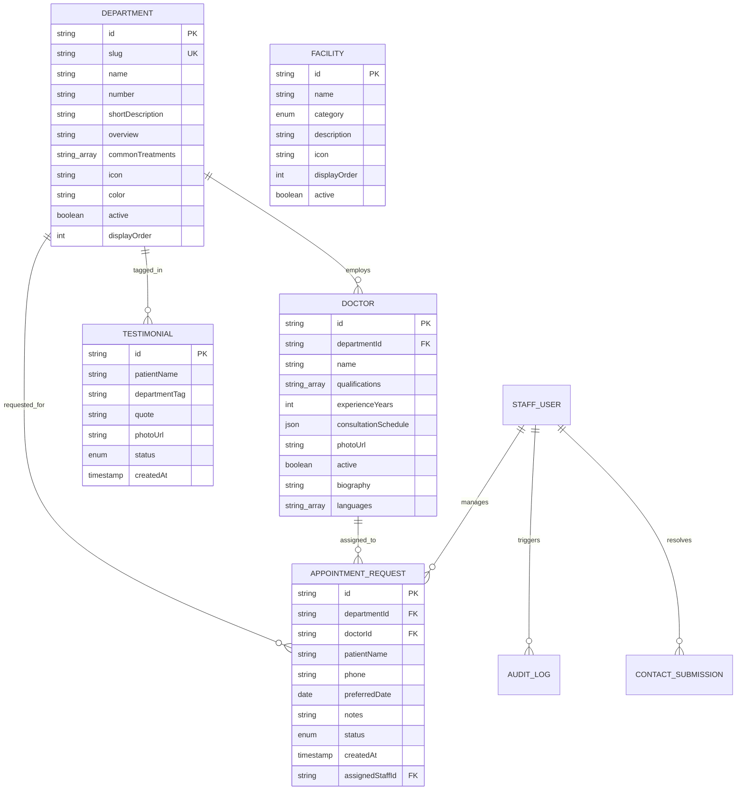
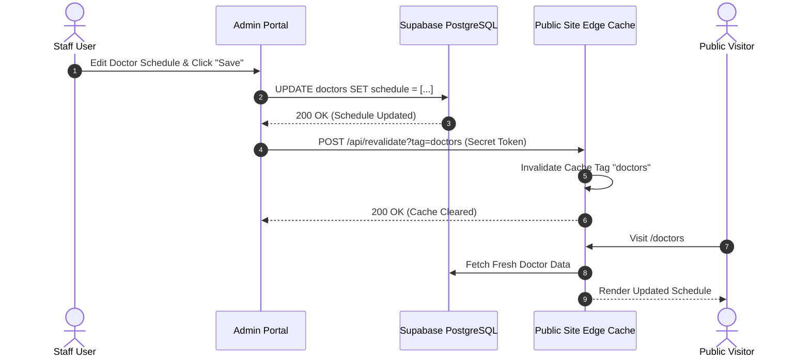

# Architectural Plan & Technical Specification: South City Hospital Admin Portal

**Document Version:** 1.0.0  
**Target System:** South City Hospital Internal Operations & Content Management Portal (`admin.southcityhospital.in`)  
**Scope:** Planning & Architectural Specification (Stand-alone Application)  
**Author:** Lead Product Architect & Full-Stack Technical Lead  

---

## Executive Summary

South City Hospital operates a high-performance, public-facing marketing and informational website serving patients across Silchar, Meherpur, and the greater Barak Valley region of Assam. Currently, the public site relies heavily on static TypeScript data dictionaries, synthetic mock files, and client-side form simulations.

This specification details the architecture, data models, workflows, security boundaries, and rollout plan for a **completely standalone Admin Portal**. Built as an independent system with its own repository, domain (`admin.southcityhospital.in`), authentication engine, and operational UI, the Admin Portal will serve as the single source of truth for hospital operations, doctor scheduling, patient triage, and public marketing content.

---

## Section 1: Analysis of the Existing Public Website

A comprehensive audit of the public web codebase (`apps/web`) was conducted across all pages (`/`, `/about`, `/departments`, `/doctors`, `/facilities`, `/testimonials`, `/faq`, `/contact`, `/gallery`) and shared components (`Navbar`, `Footer`, `BookingModal`, `HeroSection`, `AboutSection`, `CoreValuesSection`).

```
                              ┌────────────────────────────────────────────────────────┐
                              │               PUBLIC WEB APPLICATION                   │
                              │           (southcityhospital.in - Read Only)           │
                              └──────────────────────────┬─────────────────────────────┘
                                                         │
                                        Reads Data via API / Cache
                                                         │
                                                         ▼
┌───────────────────────────┐         ┌────────────────────────────────────────────────┐
│   HOSPITAL STAFF / ROLES  │         │               CENTRAL DATABASE                 │
│ • Super Admin             │         │ • PostgreSQL / Supabase Engine                 │
│ • Content Manager         ├────────►│ • S3-Compatible Media Bucket                   │
│ • Front Desk / Reception  │         │ • Row-Level Security & Audit Trails            │
│ • Doctor (Self-Service)   │         └────────────────────────▲───────────────────────┘
└─────────────┬─────────────┘                                  │
              │                                                │
              │ Writes & Manages Operations                    │
              ▼                                                │
┌──────────────────────────────────────────────────────────────┴───────────────────────┐
│                           STANDALONE ADMIN PORTAL                                    │
│                 (admin.southcityhospital.in - Private Network / RBAC)                │
└──────────────────────────────────────────────────────────────────────────────────────┘
```

---

### 1.1 Content Entities Identified

The public website currently presents 10 distinct content entities that are either hardcoded or operating on mock services:

| Entity | Current Location in Codebase | Key Attributes & Fields | Mutation Frequency |
| :--- | :--- | :--- | :--- |
| **Departments** | `src/data/departments.ts` | `id`, `slug`, `number`, `name`, `shortDescription`, `overview`, `commonTreatments[]`, `icon`, `color`, `active`, `displayOrder` | Low (Monthly/Quarterly) |
| **Doctors** | `packages/types/src/doctor.ts`, `src/mocks/doctors.mock.ts` | `id`, `name`, `departmentSlug`, `qualifications[]`, `experienceYears`, `consultationSchedule[]` (`day`, `startTime`, `endTime`), `photoUrl`, `active`, `biography`, `languages[]` | High (Weekly schedule adjustments) |
| **Facilities** | `src/data/facilities.ts` | `id`, `name`, `category` (`Diagnostic`, `Critical Care`, `Outpatient`), `description`, `icon`, `displayOrder`, `active` | Low (Quarterly/Ad-hoc) |
| **Testimonials** | `src/data/testimonials.ts` | `id`, `patientName`, `department`, `quote`, `photoUrl`, `status` (`pending`, `approved`, `archived`), `dateAdded` | Medium (Weekly) |
| **FAQs** | `src/data/faqs.ts` | `id`, `question`, `answer`, `category`, `displayOrder`, `active` | Low (Monthly) |
| **Hospital Global Settings** | `src/data/hospital.ts` | `name`, `tagline`, `established`, `managingPartner`, `address`, `phone`, `emergencyPhone`, `email`, `opdHours`, `socialLinks`, `aboutText` | Low (Rare updates) |
| **Core Values** | `src/data/hospital.ts` | `id`, `title`, `description`, `icon`, `orderNumber` | Rare |
| **Appointment Requests** | Simulated in `BookingModal.tsx` | `patientName`, `phone`, `department`, `doctor`, `preferredDate`, `notes`, `status` (`new`, `contacted`, `confirmed`, `cancelled`), `createdAt` | Very High (Real-time operational) |
| **Contact Inquiries** | Simulated in `ContactClient.tsx` | `name`, `phone`, `email`, `message`, `status` (`unread`, `in-progress`, `resolved`), `createdAt` | High (Daily operational) |
| **Gallery Media** | `src/components/ui/ImageGallery.tsx` | `id`, `url`, `alt`, `title`, `width`, `height`, `category`, `uploadedAt` | Medium (Monthly updates) |

---

### 1.2 Entity Relationships



---

### 1.3 Duplication Inventory Across Existing Codebase

Currently, static data is manually duplicated across multiple pages and components. When any hospital detail changes (e.g., telephone number, department count), developers must update dozens of files manually. 

| Data Point / Copy | Current Duplicated Locations in `apps/web` | Risk / Failure Mode |
| :--- | :--- | :--- |
| **Emergency Number (`+91 6901271223`)** | • `HeroSection.tsx` (CTA & Stats Card)<br>• `Navbar.tsx` (Top alert & quick dial)<br>• `Footer.tsx` (Emergency banner & Contact list)<br>• `AboutSection.tsx` & `/about/page.tsx`<br>• `ContactClient.tsx` (Sidebar card & success fallback)<br>• `faqs.ts` (FAQ Q1 & Q3 answers)<br>• `hospital.ts` | Inconsistent emergency numbers shown during critical triage line migrations. |
| **General Contact Details**<br>*(Phone, Email, Address, OPD Hours)* | • `Footer.tsx`<br>• `ContactClient.tsx`<br>• `/about/page.tsx`<br>• `hospital.ts`<br>• Route metadata headers (`/contact`, `/about`, `/page.tsx`) | Outdated OPD hours displayed on one page while updated on another. |
| **Hospital Stats**<br>*(Est. 2006, 13 Depts, 13 Facilities, 20+ Yrs)* | • `HeroSection.tsx` (Eyebrow, Subtitle, Floating badge)<br>• `AboutSection.tsx` (4-card stat grid)<br>• `/about/page.tsx` (Glass card overlay & Managing Partner bio)<br>• `Footer.tsx` ("At a Glance" section)<br>• `hospital.ts`<br>• `faqs.ts` (FAQ Q2 answer hardcoded "11 departments") | Hardcoded FAQ Q2 answer retained "11 departments and 12 facilities" even after new departments were added. |
| **Managing Partner Bio & Photo** | • `AboutSection.tsx`<br>• `/about/page.tsx`<br>• `hospital.ts` | Outdated executive statements or broken photo links. |
| **Core Values (3 Pillars)** | • `CoreValuesSection.tsx`<br>• `/about/page.tsx`<br>• `hospital.ts` | Desynchronized mission statements across pages. |

---

### 1.4 Placeholder and Synthetic Content Currently Live

1. **Doctor Profiles (`src/mocks/doctors.mock.ts`)**: Synthetic placeholders (`Dr. Sample One`, `Dr. Sample Two`, `Dr. Sample Three`) with hardcoded schedules and simulated random latency.
2. **Patient Testimonials (`src/data/testimonials.ts`)**: Exactly 3 hardcoded patient records with stock Unsplash profile avatars (`https://images.unsplash.com/photo-1544005313-94ddf0286df2`).
3. **Hospital Exterior & Interior Imagery**: Stock Unsplash photography used across the Hero section, About page, and `/gallery` page.
4. **Appointment Booking (`BookingModal.tsx`)**: Mock submission handler (`await new Promise(r => setTimeout(r, 1000)); setSubmitted(true);`) where patient booking requests vanish into void memory.
5. **Contact Inquiries (`ContactClient.tsx`)**: Mock submission handler with no persistence or notification triggering.

---

### 1.5 Implied Real-World Hospital Workflows

1. **Inbound Patient Appointment Triage Workflow:**
   - Patient submits booking on public site -> Request logged in database as `NEW`.
   - Admin Portal triggers real-time visual alert on Front Desk dashboard.
   - Front desk staff calls patient, verifies slot with OPD doctor schedule, sets status to `CONFIRMED` or `RESCHEDULED`, and adds internal notes.
2. **Doctor On-Leave & Roster Adjustment Workflow:**
   - A consultant takes emergency leave -> Doctor or Medical Admin toggles status to `INACTIVE` or modifies weekly schedule block in Admin Portal.
   - Public Doctors directory immediately updates doctor status chip and disables booking modal slots for that doctor.
3. **Testimonial Collection & Moderation Workflow:**
   - Front desk logs feedback or a patient submits a review -> Enters Admin Portal in `PENDING` status.
   - Content Manager edits for formatting, verifies patient consent, and approves to `PUBLISHED`.
4. **Emergency Hotline Cutover Workflow:**
   - Hospital switches telecom provider or secondary emergency line -> Super Admin updates `emergencyPhone` in Portal Settings.
   - Global cache invalidation immediately updates Navbar, Footer, Hero, and Contact pages across the public site within seconds.

---

## Section 2: Users, Roles & Permissions

The Admin Portal requires strict Role-Based Access Control (RBAC) to separate operational clinical duties from content publishing and executive configuration.

```
                              ┌──────────────────────────────────┐
                              │           SUPER ADMIN            │
                              │ (Full System Access & Governance)│
                              └─────────────────┬────────────────┘
                                                │
                     ┌──────────────────────────┼──────────────────────────┐
                     ▼                          ▼                          ▼
        ┌─────────────────────────┐┌─────────────────────────┐┌─────────────────────────┐
        │     CONTENT MANAGER     ││  FRONT DESK / RECEPTION  ││   DOCTOR / CONSULTANT   │
        │ • Marketing & Copy      ││ • Appointment Requests   ││ • Personal Profile      │
        │ • Depts / Facilities    ││ • Contact Form Inbox     ││ • Weekly Schedule       │
        │ • Testimonials & FAQs   ││ • Doctor Schedule View   ││ • Read-only Appointments│
        │ • Media Library         ││ • Patient Callback Logs  ││                         │
        └─────────────────────────┘└─────────────────────────┘└─────────────────────────┘
```

### 2.1 Role Definitions & Permission Matrix

| Module / Action | Super Admin | Content Manager | Front Desk / Reception | Doctor (Self-Service) |
| :--- | :---: | :---: | :---: | :---: |
| **Hospital Global Settings** | Full (CRUD) | Read Only | Read Only | No Access |
| **User & Staff Management** | Full (CRUD) | No Access | No Access | No Access |
| **Audit Logs** | Full (View & Export) | No Access | No Access | No Access |
| **Departments Management** | Full (CRUD) | Full (CRUD) | Read Only | Read Only |
| **Facilities Management** | Full (CRUD) | Full (CRUD) | Read Only | Read Only |
| **Doctor Directory** | Full (CRUD) | Full (CRUD) | Read Only | Edit Own Profile/Bio |
| **Doctor Schedules** | Full (CRUD) | Full (CRUD) | Read Only | Edit Own Schedule |
| **Appointment Requests** | Full (CRUD) | Read Only | Full (Manage/Update) | View Own Patients |
| **Contact Form Inbox** | Full (CRUD) | View & Reply | Full (Manage/Update) | No Access |
| **Testimonials Moderation** | Full (CRUD) | Full (CRUD) | Create Drafts | No Access |
| **FAQs Management** | Full (CRUD) | Full (CRUD) | Read Only | No Access |
| **Media & Gallery Manager** | Full (CRUD) | Full (CRUD) | No Access | Upload Own Photo |

### 2.2 Scoped Self-Service Access

- **Doctor Scope Rule:** Doctors logging in via their staff credentials are automatically restricted to `doctors.user_id = auth.uid()`. They can modify their qualifications, languages, biography, and consultation schedule slots, but cannot change department assignments, delete records, or modify other doctors.
- **Front Desk Scope Rule:** Front desk staff have access to the triage inbox and read-only directory views to quickly look up OPD schedules when answering telephone inquiries.

---

## Section 3: Core Modules & Features Specification

The Admin Portal UI will be built as a clean, high-density dashboard focused on keyboard shortcuts, quick filtering, and zero distraction.

```
┌─────────────────────────────────────────────────────────────────────────────────────────────┐
│ SOUTH CITY HOSPITAL ADMIN PORTAL                    [🔍 Global Search...] [👤 Nilava (Admin)]│
├───────────────┬─────────────────────────────────────────────────────────────────────────────┤
│ 📊 Dashboard  │  OPERATIONAL DASHBOARD                                                      │
│ 📅 Triage (14)│ ┌───────────────┐ ┌───────────────┐ ┌───────────────┐ ┌───────────────────┐ │
│ 📬 Inquiries  │ │ 14 New Bookings│ │ 5 Unread Inq. │ │ 24 Doctors On │ │ 99.8% System Sync │ │
│ 👨‍⚕️ Doctors   │ └───────────────┘ └───────────────┘ └───────────────┘ └───────────────────┘ │
│ 🏥 Departments│                                                                             │
│ 🔬 Facilities │  RECENT APPOINTMENT REQUESTS                                                │
│ 💬 Testimonials│  ┌─────────────────┬────────────────────┬──────────────┬──────────────────┐ │
│ ❓ FAQs        │  │ Patient Name    │ Department         │ Pref. Date   │ Action           │ │
│ 🖼️ Gallery     │  ├─────────────────┼────────────────────┼──────────────┼──────────────────┤ │
│ ⚙️ Settings    │  │ Joydeep Roy     │ Cardiology         │ Tomorrow     │ [Triage] [Call]  │ │
│ 📜 Audit Logs │  │ Ananya Sen      │ Orthopaedics       │ 28 Aug 2026  │ [Triage] [Call]  │ │
└───────────────┴──┴─────────────────┴────────────────────┴──────────────┴──────────────────┘ │
```

### 3.1 Operations Dashboard (Home Screen)
- **Top Metrics Strip:**
  - `New Appointment Requests` (Pending triage badge).
  - `Unread Patient Inquiries` (Contact form submissions in last 24h).
  - `Active Doctors on Duty` (Calculated based on current day of week).
  - `Pending Testimonials` (Awaiting review).
- **Urgent Action Queue:** Split table showing the latest 10 unprocessed appointment requests and unread contact messages with direct 1-click status actions ("Mark Contacted", "Confirm Slot").
- **Doctor Schedule Quick-Lookup:** Real-time search widget allowing receptionists to instantly check which doctors are available today.

---

### 3.2 Appointment Request Inbox & Triage Manager
- **List View:** Server-side paginated table with filtering by Status (`New`, `Contacted`, `Confirmed`, `Completed`, `Cancelled`), Department, Date Range, and Doctor.
- **Detail Drawer / Modal:**
  - Patient contact details with 1-click `tel:` calling integration.
  - Requested department and preferred doctor.
  - Staff internal notes thread (records who called the patient and when).
  - Status progression stepper (`New` -> `Contacted` -> `Confirmed` -> `Completed`).
- **Validation & Business Rules:**
  - Phone numbers validated against Indian format (`+91` or 10-digit standard).
  - Date picker prevents booking historic dates.

---

### 3.3 Doctor Roster & Schedule Manager
- **List View:** Grid/Table toggle showing doctor headshots, department tags, active status pills, experience years, and active schedule summaries.
- **Create / Edit Form:**
  - Full Name with credential prefix (`Dr.`).
  - Department Selection (Dropdown linked to active Departments).
  - Qualifications (Tag input with autocomplete: `MBBS`, `MD`, `MS`, `MCh`, `FRCP`, `DNB`).
  - Years of Experience (Integer input).
  - Weekly Consultation Schedule Matrix: Dynamic row builder where staff can add day groups (`Monday–Wednesday`, `Saturday`) and time pickers (`09:00` to `13:00`).
  - Languages Spoken (Tag selector: `English`, `Bengali`, `Hindi`, `Assamese`, `Sylheti`).
  - Biography (Rich text markdown editor).
  - Active/Inactive toggle.
- **Media Upload:** Integrated image cropper (1:1 square ratio) with automated WebP conversion and S3 upload.

---

### 3.4 Departments & Services Manager
- **List View:** Drag-and-drop table for setting display order (`01` through `13+`).
- **Create / Edit Form:**
  - Department Name (e.g., `Urology & Laser Surgery`).
  - URL Slug (Auto-generated from name with collision checks).
  - Order Number (Two-digit string e.g. `07`).
  - Short Description (Max 160 characters for card previews).
  - Full Clinical Overview (Multi-paragraph markdown).
  - Common Treatments List (Dynamic string array builder with add/remove items).
  - Lucide Icon Picker (Visual search through Lucide medical icon set).
  - Accent Color Variable Picker.

---

### 3.5 Facilities & Equipment Manager
- **List View:** Grouped by category (`Diagnostic`, `Critical Care`, `Outpatient`).
- **Create / Edit Form:**
  - Facility Name (e.g., `High End Digital Xray`, `Pain Clinic`).
  - Category Selector (Radio card selection).
  - Operational Description.
  - Icon Picker.
  - Active / Under-Maintenance status toggle.

---

### 3.6 Testimonials & Feedback Moderation
- **List View:** Tabbed views: `Pending Review`, `Published`, `Archived`.
- **Review Form:**
  - Patient Name & Department tag.
  - Quote text editor (allows fixing typos or formatting before publishing).
  - Optional Avatar uploader (or initials fallback preview).
  - Approval Buttons: `Approve & Publish`, `Reject / Archive`.

---

### 3.7 FAQ Manager
- **List View:** Drag-and-drop reordering per category.
- **Form:**
  - Question & Answer fields.
  - Category selector (`Emergency`, `Admissions`, `Diagnostics`, `Billing & Insurance`, `Visiting Hours`).
  - Published toggle.

---

### 3.8 Media & Gallery Asset Manager
- **Grid View:** Image asset browser with file metadata (dimensions, file size, upload date).
- **Upload Dropzone:** Multi-file drag-and-drop with client-side image compression, automated dimension detection, alt-text requirement enforcement, and CDN URL generation.

---

### 3.9 Hospital Global Settings & Emergency Broadcast
- **Emergency Helpline Bar:** Update 24/7 hotline numbers with immediate live preview.
- **Operating Hours:** Configure standard OPD timings and weekend emergency policies.
- **Leadership Profile:** Update Managing Partner name, bio statement, and portrait.
- **Social Media Links:** Instagram, Facebook, and Google Business Profile links.

---

### 3.10 System Audit Log
- **Immutable Log Table:** Logs every `CREATE`, `UPDATE`, and `DELETE` event across the system.
- **Attributes:** Timestamp, Staff User Email, User Role, Entity Type, Record ID, Diff (Previous Value vs New Value), and IP Address.

---

## Section 4: Data Model & Database Architecture

The data architecture is specified using standard SQL relational conventions, optimized for PostgreSQL with JSONB support for flexible sub-structures.

```
┌────────────────────────────────────────────────────────────────────────────────────────┐
│                                 POSTGRESQL RELATIONAL SCHEMA                           │
├──────────────────────────────┬──────────────────────────────┬──────────────────────────┤
│         departments          │           doctors            │   appointment_requests   │
├──────────────────────────────┼──────────────────────────────┼──────────────────────────┤
│ id (UUID, PK)                │ id (UUID, PK)                │ id (UUID, PK)            │
│ slug (VARCHAR, UNIQUE)       │ user_id (UUID, FK -> auth)   │ department_id (UUID, FK) │
│ name (VARCHAR)               │ department_id (UUID, FK)     │ doctor_id (UUID, FK)     │
│ number_code (VARCHAR)        │ name (VARCHAR)               │ patient_name (VARCHAR)   │
│ short_desc (VARCHAR)         │ qualifications (TEXT[])      │ phone (VARCHAR)          │
│ overview (TEXT)              │ experience_years (INT)       │ preferred_date (DATE)    │
│ common_treatments (TEXT[])   │ schedule (JSONB)             │ notes (TEXT)             │
│ icon_name (VARCHAR)          │ photo_url (TEXT)             │ status (ENUM)            │
│ color_token (VARCHAR)        │ is_active (BOOLEAN)          │ staff_notes (TEXT)       │
│ display_order (INT)          │ biography (TEXT)             │ assigned_to (UUID, FK)   │
│ is_active (BOOLEAN)          │ languages (TEXT[])           │ created_at (TIMESTAMPTZ) │
├──────────────────────────────┼──────────────────────────────┼──────────────────────────┤
│          facilities          │         testimonials         │        audit_logs        │
├──────────────────────────────┼──────────────────────────────┼──────────────────────────┤
│ id (UUID, PK)                │ id (UUID, PK)                │ id (BIGSERIAL, PK)       │
│ slug (VARCHAR, UNIQUE)       │ patient_name (VARCHAR)       │ actor_id (UUID, FK)      │
│ name (VARCHAR)               │ department_id (UUID, FK)     │ action (VARCHAR)         │
│ category (ENUM)              │ quote (TEXT)                 │ entity_type (VARCHAR)    │
│ description (TEXT)           │ photo_url (TEXT)             │ entity_id (VARCHAR)      │
│ icon_name (VARCHAR)          │ status (ENUM)                │ diff_payload (JSONB)     │
│ display_order (INT)          │ created_at (TIMESTAMPTZ)     │ created_at (TIMESTAMPTZ) │
└──────────────────────────────┴──────────────────────────────┴──────────────────────────┘
```

### 4.1 Schema Definitions

#### 1. `departments`
```sql
CREATE TABLE departments (
    id UUID PRIMARY KEY DEFAULT gen_random_uuid(),
    slug VARCHAR(64) UNIQUE NOT NULL,
    number_code VARCHAR(8) NOT NULL, -- e.g. '01', '12'
    name VARCHAR(128) NOT NULL,
    short_description VARCHAR(255) NOT NULL,
    overview TEXT NOT NULL,
    common_treatments TEXT[] NOT NULL DEFAULT '{}',
    icon_name VARCHAR(64) NOT NULL DEFAULT 'Stethoscope',
    color_token VARCHAR(64) NOT NULL DEFAULT 'var(--primary)',
    display_order INT NOT NULL DEFAULT 0,
    is_active BOOLEAN NOT NULL DEFAULT TRUE,
    created_at TIMESTAMPTZ NOT NULL DEFAULT NOW(),
    updated_at TIMESTAMPTZ NOT NULL DEFAULT NOW()
);
CREATE INDEX idx_departments_slug ON departments(slug);
CREATE INDEX idx_departments_active ON departments(is_active);
```

#### 2. `doctors`
```sql
CREATE TABLE doctors (
    id UUID PRIMARY KEY DEFAULT gen_random_uuid(),
    user_id UUID REFERENCES auth.users(id) ON DELETE SET NULL, -- Optional link for self-service login
    department_id UUID NOT NULL REFERENCES departments(id) ON DELETE RESTRICT,
    name VARCHAR(128) NOT NULL,
    qualifications TEXT[] NOT NULL DEFAULT '{}', -- e.g. ['MBBS', 'MD (Cardiology)']
    experience_years INT NOT NULL DEFAULT 0,
    schedule JSONB NOT NULL DEFAULT '[]', -- Array of { "day": "Mon-Wed", "startTime": "09:00", "endTime": "13:00" }
    photo_url TEXT,
    is_active BOOLEAN NOT NULL DEFAULT TRUE,
    biography TEXT,
    languages TEXT[] NOT NULL DEFAULT '{"English", "Bengali"}',
    created_at TIMESTAMPTZ NOT NULL DEFAULT NOW(),
    updated_at TIMESTAMPTZ NOT NULL DEFAULT NOW()
);
CREATE INDEX idx_doctors_dept ON doctors(department_id);
CREATE INDEX idx_doctors_active ON doctors(is_active);
```

#### 3. `facilities`
```sql
CREATE TYPE facility_category AS ENUM ('Diagnostic', 'Critical Care', 'Outpatient');

CREATE TABLE facilities (
    id UUID PRIMARY KEY DEFAULT gen_random_uuid(),
    slug VARCHAR(64) UNIQUE NOT NULL,
    name VARCHAR(128) NOT NULL,
    category facility_category NOT NULL,
    description TEXT NOT NULL,
    icon_name VARCHAR(64) NOT NULL DEFAULT 'Search',
    display_order INT NOT NULL DEFAULT 0,
    is_active BOOLEAN NOT NULL DEFAULT TRUE,
    created_at TIMESTAMPTZ NOT NULL DEFAULT NOW(),
    updated_at TIMESTAMPTZ NOT NULL DEFAULT NOW()
);
CREATE INDEX idx_facilities_category ON facilities(category);
```

#### 4. `appointment_requests`
```sql
CREATE TYPE appointment_status AS ENUM ('new', 'contacted', 'confirmed', 'completed', 'cancelled');

CREATE TABLE appointment_requests (
    id UUID PRIMARY KEY DEFAULT gen_random_uuid(),
    department_id UUID NOT NULL REFERENCES departments(id) ON DELETE RESTRICT,
    doctor_id UUID REFERENCES doctors(id) ON DELETE SET NULL,
    patient_name VARCHAR(128) NOT NULL,
    phone VARCHAR(20) NOT NULL,
    preferred_date DATE NOT NULL,
    notes TEXT,
    status appointment_status NOT NULL DEFAULT 'new',
    staff_notes TEXT,
    assigned_to UUID REFERENCES auth.users(id) ON DELETE SET NULL,
    created_at TIMESTAMPTZ NOT NULL DEFAULT NOW(),
    updated_at TIMESTAMPTZ NOT NULL DEFAULT NOW()
);
CREATE INDEX idx_appointments_status ON appointment_requests(status);
CREATE INDEX idx_appointments_created ON appointment_requests(created_at DESC);
```

#### 5. `contact_submissions`
```sql
CREATE TYPE inquiry_status AS ENUM ('unread', 'in_progress', 'resolved', 'archived');

CREATE TABLE contact_submissions (
    id UUID PRIMARY KEY DEFAULT gen_random_uuid(),
    name VARCHAR(128) NOT NULL,
    phone VARCHAR(20) NOT NULL,
    email VARCHAR(128),
    message TEXT NOT NULL,
    status inquiry_status NOT NULL DEFAULT 'unread',
    staff_notes TEXT,
    resolved_by UUID REFERENCES auth.users(id) ON DELETE SET NULL,
    created_at TIMESTAMPTZ NOT NULL DEFAULT NOW(),
    updated_at TIMESTAMPTZ NOT NULL DEFAULT NOW()
);
CREATE INDEX idx_contact_status ON contact_submissions(status);
```

#### 6. `testimonials`
```sql
CREATE TYPE testimonial_status AS ENUM ('pending', 'approved', 'archived');

CREATE TABLE testimonials (
    id UUID PRIMARY KEY DEFAULT gen_random_uuid(),
    patient_name VARCHAR(128) NOT NULL,
    department_id UUID REFERENCES departments(id) ON DELETE SET NULL,
    quote TEXT NOT NULL,
    photo_url TEXT,
    status testimonial_status NOT NULL DEFAULT 'pending',
    display_order INT NOT NULL DEFAULT 0,
    created_at TIMESTAMPTZ NOT NULL DEFAULT NOW()
);
```

#### 7. `faqs`
```sql
CREATE TABLE faqs (
    id UUID PRIMARY KEY DEFAULT gen_random_uuid(),
    question TEXT NOT NULL,
    answer TEXT NOT NULL,
    category VARCHAR(64) NOT NULL DEFAULT 'General',
    display_order INT NOT NULL DEFAULT 0,
    is_active BOOLEAN NOT NULL DEFAULT TRUE,
    created_at TIMESTAMPTZ NOT NULL DEFAULT NOW()
);
```

#### 8. `hospital_settings` (Singleton Table)
```sql
CREATE TABLE hospital_settings (
    id INT PRIMARY KEY DEFAULT 1,
    name VARCHAR(128) NOT NULL,
    tagline VARCHAR(255) NOT NULL,
    established_year INT NOT NULL,
    managing_partner VARCHAR(128) NOT NULL,
    address TEXT NOT NULL,
    phone VARCHAR(32) NOT NULL,
    emergency_phone VARCHAR(32) NOT NULL,
    email VARCHAR(128) NOT NULL,
    opd_days VARCHAR(64) NOT NULL,
    opd_hours VARCHAR(64) NOT NULL,
    instagram_url TEXT,
    facebook_url TEXT,
    about_text TEXT NOT NULL,
    updated_at TIMESTAMPTZ NOT NULL DEFAULT NOW(),
    CONSTRAINT single_row_check CHECK (id = 1)
);
```

#### 9. `audit_logs`
```sql
CREATE TABLE audit_logs (
    id BIGSERIAL PRIMARY KEY,
    actor_id UUID REFERENCES auth.users(id) ON DELETE SET NULL,
    actor_email VARCHAR(128) NOT NULL,
    action VARCHAR(32) NOT NULL, -- 'INSERT', 'UPDATE', 'DELETE'
    entity_type VARCHAR(64) NOT NULL, -- 'doctors', 'departments', 'hospital_settings'
    entity_id VARCHAR(64) NOT NULL,
    old_data JSONB,
    new_data JSONB,
    ip_address INET,
    created_at TIMESTAMPTZ NOT NULL DEFAULT NOW()
);
CREATE INDEX idx_audit_entity ON audit_logs(entity_type, entity_id);
CREATE INDEX idx_audit_created ON audit_logs(created_at DESC);
```

---

## Section 5: Architecture, Separation & Tech Stack

```
                                    DOMAIN BOUNDARIES
 ┌───────────────────────────────────────┐     ┌───────────────────────────────────────┐
 │          PUBLIC WEBSITE               │     │             ADMIN PORTAL              │
 │      southcityhospital.in             │     │       admin.southcityhospital.in      │
 │  (Patient-Facing Marketing Web App)   │     │      (Internal Operational App)       │
 └──────────────────┬────────────────────┘     └───────────────────┬───────────────────┘
                    │                                              │
                    │ Read-Only (ISR Cached)                       │ Read/Write (Authenticated)
                    ▼                                              ▼
 ┌─────────────────────────────────────────────────────────────────────────────────────┐
 │                         SECURE DATA & API LAYER (Supabase)                          │
 │  • PostgreSQL Database with Strict Row-Level Security (RLS)                         │
 │  • Public Anon Key: SELECT on is_active=true; INSERT on appointments/inquiries      │
 │  • Admin Service Role / Staff Auth: Full RBAC via JWT Claims                        │
 │  • On-Demand Revalidation Webhook Trigger (Purges Public Next.js Edge Cache)         │
 └─────────────────────────────────────────────────────────────────────────────────────┘
```

### 5.1 Clear Application & Network Separation
1. **Isolated Codebase:** The Admin Portal will be established in a separate repository or dedicated workspace app (`apps/admin`), completely decoupled from the public website's frontend logic, client bundles, and build pipeline.
2. **Subdomain Deployment:** Hosted independently at `admin.southcityhospital.in` with access restricted at the DNS/WAF level (Cloudflare Access or IP allowlisting where appropriate).
3. **No Public Auth Surface on Marketing Site:** The public website contains no login buttons, staff portals, or administrative entry points.

---

### 5.2 Integration Pattern: Shared Database with Managed API Boundary
**Recommendation:** **Shared Managed PostgreSQL Engine (Supabase / RDS) with Role-Based RLS and Webhook Revalidation.**

- **Why this approach wins:**
  1. **Zero Intermediate Microservice Overhead:** Avoids the operational cost and latency of maintaining a separate intermediate Node.js API container solely for standard CRUD tasks.
  2. **Row-Level Security (RLS) as Contract:** PostgreSQL RLS natively guarantees that the public website key can **only** read published records (`is_active = true`, `status = 'approved'`) and insert into `appointment_requests` and `contact_submissions`.
  3. **Instant Cache Purging via On-Demand Revalidation:** When an admin modifies a doctor's schedule or emergency number, a database trigger or Next.js route handler calls the public site's `/api/revalidate?tag=doctors` endpoint, instantly invalidating edge cache without redeploying.

---

### 5.3 Recommended Tech Stack for the Admin Portal

| Layer | Technology Choice | Architectural Justification |
| :--- | :--- | :--- |
| **Framework** | **Next.js (App Router, TypeScript)** or **Vite + React SPA** | Familiar React ecosystem; high build speed; server components provide instant server-side auth checks. |
| **UI Component System** | **Shadcn UI (Radix UI) + Tailwind CSS** | Clean, high-density, unstyled accessibility primitives built for professional internal tools (data tables, modals, drawers, date pickers). |
| **Data Fetching / State** | **TanStack Query (React Query v5)** | Built-in caching, optimistic updates, background refetching, and query invalidation. |
| **Table Management** | **TanStack Table (React Table v8)** | High-performance sorting, multi-column filtering, pagination, and column visibility toggles for high-volume patient request tables. |
| **Forms & Validation** | **React Hook Form + Zod** | Matches the type safety of `@sch/types`, handles complex dynamic arrays (e.g. consultation schedules) effortlessly. |
| **Authentication** | **Supabase Auth / NextAuth** | Robust session management, HttpOnly cookies, built-in MFA/TOTP support, and JWT claims for RBAC. |
| **Media Storage** | **Supabase Storage / AWS S3 + CloudFront** | S3-compatible asset storage with signed upload URLs and image transformations. |

---

### 5.4 Public Site Caching & Instant Publishing Pipeline



---

## Section 6: Security, Access Control & Compliance

Healthcare-adjacent platforms require strict operational safeguards to protect patient contact inquiries, appointment notes, and staff authentication credentials.

### 6.1 Authentication Hardening
1. **Invite-Only Staff Provisioning:** Self-registration is completely disabled. Accounts can only be created by a Super Admin dispatching cryptographic email invitations.
2. **Mandatory Two-Factor Authentication (2FA):** Enforced via TOTP Authenticator apps (Google Authenticator, Microsoft Authenticator) for Super Admin and Content Manager roles.
3. **Session Management:** Secure, `HttpOnly`, `SameSite=Strict`, `Secure` session cookies with automatic 30-minute idle timeouts.

---

### 6.2 Data Privacy & Patient Information Retention
1. **Patient Data Classification:** Form submissions (`appointment_requests` and `contact_submissions`) contain Personally Identifiable Information (PII) including patient names, mobile numbers, and clinical symptoms/notes.
2. **Restricted Access:** Clinical notes and patient inquiries are inaccessible to the `Content Manager` role and restricted strictly to `Super Admin` and `Front Desk`.
3. **Automated Data Retention & Purge Policy:**
   - Completed appointment records and resolved inquiries older than 180 days have their personal notes scrubbed, retaining anonymized metadata for volume reporting.
   - Any patient requesting data removal under Indian Digital Personal Data Protection (DPDP) regulations can be purged via a 1-click "Anonymize Patient" button in the admin interface.

---

### 6.3 Audit Logging & Non-Repudiation
- Every write operation automatically logs an immutable event record capturing the actor UUID, target record, action type, IP address, and JSON diff payload.
- Deletion of records is implemented as a **Soft Delete** (`is_active = false` or `is_deleted = true`), preventing accidental or malicious permanent data destruction.

---

## Section 7: Assumptions & Open Stakeholder Questions

### 7.1 Key Assumptions Made in this Specification
1. **No Direct EMR/EHR Integration in Phase 1:** Assumed the hospital's internal electronic medical records (EMR) or physical billing desk software does not currently expose a modern REST API; hence, the Admin Portal will act as the first digital triage layer before staff manually book patients into internal hospital ledgers.
2. **Staff Headcount:** Assumed a core staff size of 5–15 portal users (1 Super Admin / Hospital Director, 2 Content Managers, 4–8 Front Desk staff, and optional self-service doctors).
3. **Language Support:** Assumed administrative data entry will be conducted in English, with content fields supporting unicode UTF-8 characters for regional naming in Bengali/Assamese.
4. **Testimonial Consent:** Assumed patient testimonials require explicit offline or administrative verification before being approved for public broadcast.

---

### 7.2 Open Stakeholder Questions Prior to Build

```
┌─────────────────────────────────────────────────────────────────────────────────────────┐
│                               STAKEHOLDER DECISION CHECKLIST                            │
├─────────────────────────────────────────────────────────────────────────────────────────┤
│ [ ] 1. Do doctors want personal portal logins, or will front-desk/admin handle all?     │
│ [ ] 2. What automated SMS/WhatsApp alerts should trigger when appointments are booked?  │
│ [ ] 3. Who is the primary point of contact for emergency hotline number changes?        │
│ [ ] 4. Does the hospital have an existing AWS / Cloudflare / Supabase account?          │
│ [ ] 5. Is there a physical photo archive for doctor portraits and department facilities?│
└─────────────────────────────────────────────────────────────────────────────────────────┘
```

1. **Doctor Self-Service vs. Centralized Management:** Will individual doctors log in to manage their own schedules, or does hospital administration prefer front-desk coordinators to handle all doctor profiles centrally?
2. **Patient Notifications & SMS Gateway:** When front-desk staff update an appointment to `CONFIRMED`, should the system trigger an automated SMS or WhatsApp confirmation via a regional gateway (e.g. Gupshup, Twilio, MSG91)?
3. **Doctor Fee & OPD Token Management:** Should doctor profiles include consultation fees or live token tracking in future iterations?
4. **Hosting Infrastructure Preferences:** Does South City Hospital have existing cloud accounts (AWS, Supabase, Google Cloud, Cloudflare), or should a greenfield cloud deployment be provisioned?

---

## Section 8: Suggested Build Phases & Implementation Roadmap

The build roadmap is prioritized strictly by **content duplication pain points** and **operational risk mitigation**.

```
┌─────────────────────────────────────────────────────────────────────────────────────────┐
│ BUILD ROADMAP & MILESTONES                                                              │
├─────────────────────────────────────────────────────────────────────────────────────────┤
│ 🚀 PHASE 1: Core Foundation & High-Duplication Entities (Weeks 1–3)                     │
│    • Standalone Next.js/Tailwind Admin App & Supabase Auth RBAC                         │
│    • Hospital Global Settings (Emergency phone, OPD hours, Address)                     │
│    • Departments, Facilities & Doctors Management                                       │
│    • Public site webhook revalidation integration                                       │
├─────────────────────────────────────────────────────────────────────────────────────────┤
│ 📋 PHASE 2: Operational Triage & Inbound Inboxes (Weeks 4–5)                            │
│    • Live Appointment Requests Inbox & Triage Stepper                                   │
│    • Contact Form Inquiries Management                                                  │
│    • Real-time desk notifications & Staff Notes                                         │
├─────────────────────────────────────────────────────────────────────────────────────────┤
│ ✍️ PHASE 3: Marketing Content & Media Management (Weeks 6–7)                            │
│    • Testimonials Moderation Queue                                                      │
│    • FAQ Management & Drag-and-drop Reordering                                          │
│    • Media & Gallery Asset Manager with Cloudinary/S3 Cropper                           │
├─────────────────────────────────────────────────────────────────────────────────────────┤
│ 🛡️ PHASE 4: Security Hardening, Audit Logs & Doctor Self-Service (Weeks 8–9)             │
│    • Comprehensive Audit Log Viewer & Diff Inspector                                    │
│    • Doctor Scoped Self-Service Logins                                                  │
│    • Session timeout, 2FA enforcement, and backup automation                            │
└─────────────────────────────────────────────────────────────────────────────────────────┘
```

---

### Detailed Milestone Breakdown

#### **Phase 1: Foundation & High-Duplication Content Engine**
- **Objective:** Eliminate the risk of desynchronized emergency numbers, doctor rosters, and hospital stats across the public site.
- **Deliverables:**
  - Standalone repository and deployment at `admin.southcityhospital.in`.
  - Database schema migrations and Supabase Auth with Super Admin & Content Manager roles.
  - Global Settings module (Emergency helpline, OPD hours, contact info, stats counters).
  - Departments & Facilities CRUD modules.
  - Doctor Directory & Schedule builder.
  - Public Next.js on-demand revalidation webhook hookup.

#### **Phase 2: Operational Inboxes & Patient Triage**
- **Objective:** Transform the public booking and contact forms from static simulations into a live clinical lead generation and triage pipeline.
- **Deliverables:**
  - Connect public site `BookingModal` and `ContactClient` to live database endpoints.
  - Front Desk Appointment Request Triage Board (Filter by status, date, doctor).
  - Contact Form Inquiry Inbox with staff response tracking.
  - Internal staff notes on patient records.

#### **Phase 3: Marketing & Content Moderation**
- **Objective:** Give marketing and PR staff complete autonomy over reviews, media, and customer support content.
- **Deliverables:**
  - Patient Testimonials review and publishing workflow.
  - FAQ categorizer and reordering engine.
  - Media & Gallery asset library with automated WebP optimization.

#### **Phase 4: Governance, Security & Self-Service**
- **Objective:** Finalize enterprise security, compliance trails, and doctor portal access.
- **Deliverables:**
  - Immutable Audit Logging with diff history inspector.
  - Doctor Self-Service role activation.
  - Two-Factor Authentication (2FA) enforcement for administrative accounts.
  - Automated database backup and failover routines.

---

## Conclusion & Next Steps

This specification establishes a complete blueprint for developing South City Hospital's Admin Portal as an independent, scalable, and secure operational platform. By centralizing hospital operations into a dedicated internal tool, the hospital will eliminate content duplication errors, streamline patient triage, and establish a modern foundation for future digital healthcare services.

**Immediate Next Step:** Review open stakeholder questions with the hospital leadership team prior to initializing repository scaffolding and database provisioning.

